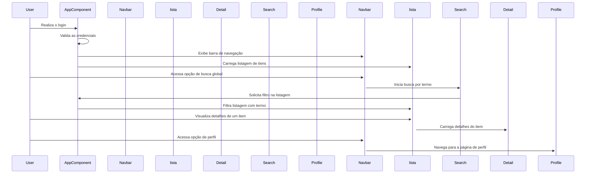

# Documentação do Projeto: Dashboard Angular 2+

## Visão Geral

Este projeto consiste na implementação de um dashboard em Angular 16 que se conecta à versão REST da [Rick and Morty API](https://rickandmortyapi.com/documentation/#rest) para exibir listagens paginadas com scroll infinito e detalhes dos itens, além de uma barra de busca global que filtra as listagens ativas.

## Tecnologias Utilizadas

- Angular 15
- Bootstrap 5
- PrimeNG 16

## Configuração do Ambiente de Desenvolvimento

* Instalação do Angular 15

```
npm i -g @angular/cli@15
```

* Criar um novo projeto

```
ng new angular-rickandmortyapi
? Would you like to add Angular routing? (y/N) y

? Which stylesheet format would you like to use? (Use arrow keys)
> CSS 
  SCSS   [ https://sass-lang.com/documentation/syntax#scss                ] 
  Sass   [ https://sass-lang.com/documentation/syntax#the-indented-syntax ] 
  Less   [ http://lesscss.org                                             ]

ng g s api --skip-tests
```

## Estrutura de Diretórios

```
angular-rickandmortyapi/
│
├── src/
│   ├── app/
│   │   ├── view/
│   │   │   ├── lista/
│   │   │   │   ├── lista.component.html
│   │   │   │   ├── lista.component.ts
│   │   │   │   ├── lista.component.css
│   │   │   │   ├── lista-detalhes/
│   │   │   │   │   ├── lista-detalhes.component.html
│   │   │   │   │   ├── lista-detalhes.component.ts
│   │   │   │   │   └── lista-detalhes.component.css
│   │   │   │   └── lista-busca/
│   │   │   │       ├── lista-busca.component.html
│   │   │   │       ├── lista-busca.component.ts
│   │   │   │       └── lista-busca.component.css
│   │   │   ├── login/
│   │   │   │   ├── login.component.html
│   │   │   │   ├── login.component.ts
│   │   │   │   └── login.component.css
│   │   │   ├── perfil/
│   │   │   │   ├── perfil.component.html
│   │   │   │   ├── perfil.component.ts
│   │   │   │   └── perfil.component.css
│   │   │   └── menu/
│   │   │       ├── menu.component.html
│   │   │       ├── menu.component.ts
│   │   │       └── menu.component.css
│   │   ├── services/
│   │   │   ├── api.service.ts
│   │   │   ├── lista.service.ts
│   │   │   └── login.guard.ts
│   │   ├── models/
|   |   |   ├── characters.model.ts
│   │   │   ├── lista.model.ts
│   │   │   ├── usuario.model.ts
│   │   ├── util/
│   │   │   └── chart.util.ts
│   │   ├── guards/
│   │   │   └── auth.guard.ts
│   │   ├── app-routing.module.ts
│   │   ├── app.component.html
│   │   ├── app.component.ts
│   │   ├── app.module.ts
│   │   └── app.component.css
│   ├── assets/
│   │   ├── images/
│   │   └── ...
│   ├── environments/
│   │   ├── environment.ts
│   │   └── environment.prod.ts
│   ├── index.html
│   └── ...
├── angular.json
├── package.json
└── ...
```

## Componentes Principais

### 1\. Listagem (Lista)

- **Descrição**: Componente responsável por exibir a lista de itens com paginação e scroll infinito.
- **Funcionalidades**:
    - Paginação de itens
    - Scroll infinito para carregar mais itens
    - Detalhes ao clicar em um item
- **Arquivos**:
    - lista.component.html
    - lista.component.ts
    - lista.component.css

### 2\. Detalhes da Listagem (lista detalhes)

- **Descrição**: Componente para exibir os detalhes de um item da listagem.
- **Funcionalidades**:
    - Exibir detalhes do item selecionado
- **Arquivos**:
    - lista-detalhes.component.html
    - lista-detalhes.component.ts
    - lista-detalhes.component.cs


### 3\. Menu (Menu)

- **Descrição**: Componente de navegação para a aplicação.
- **Funcionalidades**:
    - Menu de navegação
    - Exibição do nome do usuário logado
- **Arquivos**:
    - menu.component.html
    - menu.component.ts
    - menu.component.css

## Serviços

### 1\. API Service

- **Descrição**: Serviço para integração com a API REST.
- **Funcionalidades**:
    - Métodos para requisições HTTP (GET, POST, etc.)
- **Arquivos**:
    - api.service.ts
    - lista.service.ts
    - login.service.ts

## Modelos

- **Characters Model**: Modelo para os personagens
- **Location Character Model**: Modelo para a localização do personagem
- **Origin Character Model**: Modelo para a origem do personagem
- **User Model**: Modelo para os dados do usuário logado

## Rotas

- **"/"**: Página inicial (dashboard)
- **"/characters/:id"**: Página de um dos personagens de Rick and Morty
- **"/login"**: Página de login

## Guardas de Rota

- **AuthGuard**: Guarda de rota para proteger páginas restritas (ex: perfil)

## Observações

- A implementação da tela de login, perfil e menu são opcionais.
- Utilizar mocks para simular a autenticação e dados do usuário (caso a implementação seja opcional).

## Diagrama de sequência

