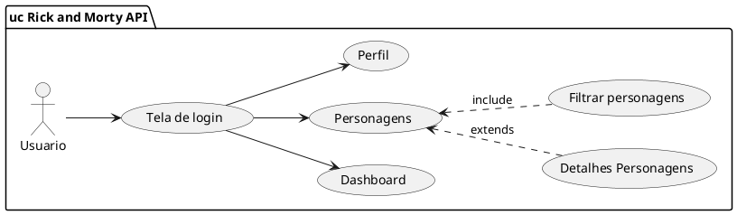
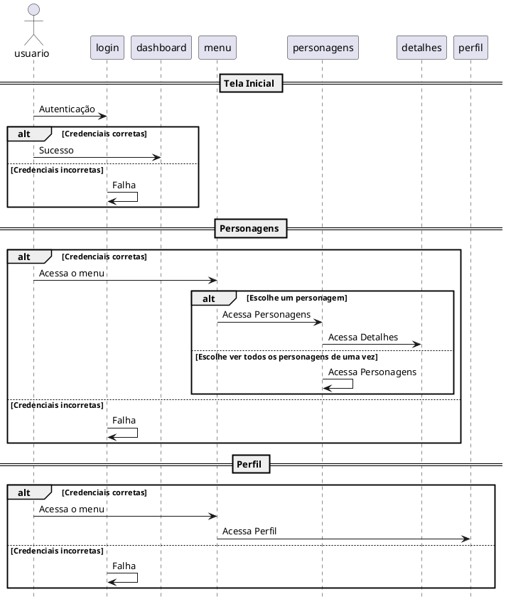

# Documentação do Projeto: Dashboard Angular 2+

## Visão Geral

Este projeto consiste na implementação de um dashboard em Angular 15 que se conecta à versão REST da [Rick and Morty API](https://rickandmortyapi.com/documentation/#rest) para exibir listagens paginadas com scroll infinito e detalhes dos itens, além de uma barra de busca global que filtra as listagens ativas.

## Tecnologias Utilizadas

- Angular 15
- Bootstrap 5
- PrimeNG 16 
- Ng-select 10
- Chart.js 4

## Justificativa

O PrimeNG foi escolhido por ser uma tecnologia desenvolvida para o framework Angular
e por eu já usar ela no trabalho. De igual modo, o Chart.js e o Ng-select. Tive problemas
com o p-dropdown e por isso a escolha de um select.

## Configuração do Ambiente de Desenvolvimento

### Instalação do Angular 15

```
npm i -g @angular/cli@15
```
* Criar um novo projeto

```
ng new angular-rickandmortyapi
? Would you like to add Angular routing? (y/N) y

? Which stylesheet format would you like to use? (Use arrow keys)
> CSS 
  SCSS   [ https://sass-lang.com/documentation/syntax#scss                ] 
  Sass   [ https://sass-lang.com/documentation/syntax#the-indented-syntax ] 
  Less   [ http://lesscss.org                                             ]


### Bibliotecas

* PrimeNG

npm i --save primeng@15
npm i --save primeicons@15
npm i --save @ng-select/ng-select@10.0.4
npm i --save chart.js@4.4.2
npm i --save primeflex@3.3.1

* Bootstrap

Inserir itens no index.html (link e script)

Na tag head
<link href="https://cdn.jsdelivr.net/npm/bootstrap@5.3.3/dist/css/bootstrap.min.css" rel="stylesheet" integrity="sha384-QWTKZyjpPEjISv5WaRU9OFeRpok6YctnYmDr5pNlyT2bRjXh0JMhjY6hW+ALEwIH" crossorigin="anonymous">

No fim do body
<script src="https://cdn.jsdelivr.net/npm/bootstrap@5.3.3/dist/js/bootstrap.bundle.min.js" integrity="sha384-YvpcrYf0tY3lHB60NNkmXc5s9fDVZLESaAA55NDzOxhy9GkcIdslK1eN7N6jIeHz" crossorigin="anonymous"></script>

```
* Mais informações sobre as tecnologias
  
[Site do Bootstrap](https://getbootstrap.com/docs/5.3/getting-started/introduction/)

[Site do Angular](https://angular.io/tutorial/first-app)

[Site do PrimeNG](https://primeng.org/installation)

[Site do Chart.js](https://www.chartjs.org/docs/latest/getting-started/)

[Site do ng-select](https://www.npmjs.com/package/@ng-select/ng-select)

## Estrutura de Diretórios

```
angular-rickandmortyapi/
│
├── src/
│   ├── app/
│   │   ├── view/
|   |   |   ├── dashboard/
│   │   │   │   ├── dashboard.component.html
│   │   │   │   ├── dashboard.component.ts
│   │   │   │   └── dashboard.component.css
│   │   │   ├── lista/
│   │   │   │   ├── lista.component.html
│   │   │   │   ├── lista.component.ts
│   │   │   │   ├── lista.component.css
│   │   │   │   ├── lista-detalhes/
│   │   │   │   │   ├── lista-detalhes.component.html
│   │   │   │   │   ├── lista-detalhes.component.ts
│   │   │   │   │   └── lista-detalhes.component.css
│   │   │   ├── login/
│   │   │   │   ├── login.component.html
│   │   │   │   ├── login.component.ts
│   │   │   │   └── login.component.css
│   │   │   ├── perfil/
│   │   │   │   ├── perfil.component.html
│   │   │   │   ├── perfil.component.ts
│   │   │   │   └── perfil.component.css
│   │   │   └── menu/
│   │   │       ├── menu.component.html
│   │   │       ├── menu.component.ts
│   │   │       └── menu.component.css
│   │   ├── services/
│   │   │   ├── api.service.ts
│   │   │   ├── lista.service.ts
│   │   │   └── login.guard.ts
│   │   ├── models/
|   |   |   ├── characters.model.ts
│   │   │   ├── lista.model.ts
│   │   │   ├── usuario.model.ts
│   │   ├── util/
│   │   │   └── chart.util.ts
│   │   ├── guards/
│   │   │   └── auth.guard.ts
│   │   ├── app-routing.module.ts
│   │   ├── app.component.html
│   │   ├── app.component.ts
│   │   ├── app.module.ts
│   │   └── app.component.css
│   ├── assets/
│   │   ├── images/
│   │   └── ...
│   ├── environments/
│   │   ├── environment.ts
│   │   └── environment.prod.ts
│   ├── index.html
│   └── ...
├── angular.json
├── package.json
└── ...
```

## Componentes Principais

### 1\. Listagem (Lista)

- **Descrição**: Componente responsável por exibir a lista de itens com paginação e scroll infinito.
- **Funcionalidades**:
    - Paginação de itens
    - Scroll infinito para carregar mais itens
    - Detalhes ao clicar em um item
- **Arquivos**:
    - lista.component.html
    - lista.component.ts
    - lista.component.css

### 2\. Detalhes da Listagem (lista detalhes)

- **Descrição**: Componente para exibir os detalhes de um item da listagem.
- **Funcionalidades**:
    - Exibir detalhes do item selecionado
    - Filtro de personagem por tipos gerais, gênero, espécie e status.
- **Arquivos**:
    - lista-detalhes.component.html
    - lista-detalhes.component.ts
    - lista-detalhes.component.cs


### 3\. Menu

- **Descrição**: Componente de navegação para a aplicação.
- **Funcionalidades**:
    - Menu de navegação
    - Exibição do nome do usuário logado
- **Arquivos**:
    - menu.component.html
    - menu.component.ts
    - menu.component.css
 
### 4\. Perfil

- **Descrição**: Componente para visualizar perfil do usuário
- **Funcionalidades**:
    - Exibir informações do usuário logado
- **Arquivos**:
    - perfil.component.html
    - perfil.component.ts
    - perfil.component.css

### 5\. Login

- **Descrição**: Tela de autenticação do usuário
- **Funcionalidades**:
    - Receber dados para a login na aplicação
- **Arquivos**:
    - login.component.html
    - login.component.ts
    - login.component.css
 
### 6\. Dashboard

- **Descrição**: Métricas sobre dados da rickandmorty API
- **Funcionalidades**:
    - Exibir gráficos e cards com valores de métricas da API
- **Arquivos**:
    - dashboard.component.html
    - dashboard.component.ts
    - dashboard.component.css

## Serviços

### 1\. API Service

- **Descrição**: Serviço para integração com a API REST.
- **Funcionalidades**:
    - Métodos para requisições HTTP (GET, POST, etc.)
- **Arquivos**:
    - login.service.ts

### 2\. Login Service

- **Descrição**: Serviço para autenticação do usuário ao sistema
- **Funcionalidades**:
    - Fazer login caso o usuário possua o login usuario e uma senha qualquer.
    - Fazer logout, retirando as credenciais do localStorage(colocadas no login).
- **Arquivos**:
    - login.service.ts

## Modelos

- **Characters Model**: Modelo para os personagens
- **Location Character Model**: Modelo para a localização do personagem
- **Origin Character Model**: Modelo para a origem do personagem

## Rotas

- **"/"**: Página inicial (dashboard)
- **"/characters"**: Página de listagem e filtro de personagens
- **"/characters/:id"**: Página de um dos personagens de Rick and Morty
- **"/login"**: Página de login

## Guardas de Rota

- **AuthGuard**: Guarda de rota para proteger páginas restritas (ex: perfil)

## Utils

- **chart.util.ts** : Util para geração de gráficos com os chart.js

## Diagrama de casos de uso



## Diagrama de sequência



